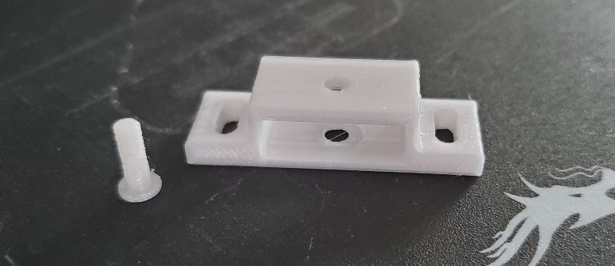
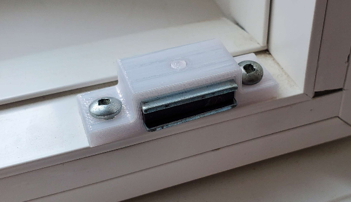

# Overview

This repository is meant to showcase small 3D printing projects and knick knacks that I have designed and that can be used around the house.

Each project will include the design files needed to edit and print the parts along with some reference material such as a list of dimensions and a detailed drawing.

## Shutter Magnet Holder

### Purpose:
The shutters in my home have a very basic magnet latching mechanism however, the magnet holders keep degrading and quickly become brittle which causes them to break very easily when the shutters are opened/closed. I created this project to be able to easily replace the broken magnet holders.

### Final Product

